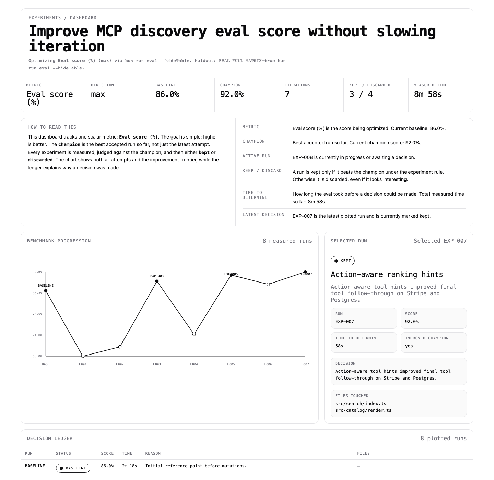
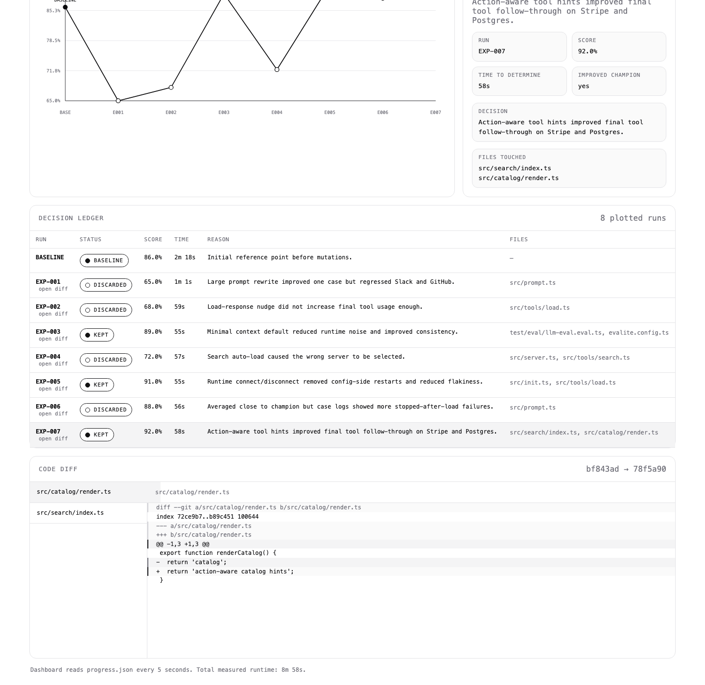

# Skills

Curated agent skills for iterative coding workflows.

## Included Skills

| Skill | Description |
| --- | --- |
| [experiments](skills/experiments) | Sets up and runs a champion-based experiment loop for optimizing a single metric over time. It helps define the metric, bootstrap a cheap benchmark, scaffold the loop, and keep or discard changes based on measured results. |
| [pr-comments](skills/pr-comments) | Processes PR review comments with parallel analysis and sequential resolution. |
| [ralph-loop](skills/ralph-loop) | Scaffolds a task-oriented loop that repeatedly picks the next unfinished work item until the backlog is complete. |
| [ui-pr](skills/ui-pr) | Captures and attaches current UI evidence for pull requests with user-visible changes. |

## Experiment Sandboxes

The repo also includes two small sandbox projects under [sandboxes](./sandboxes) for exercising the `experiments` skill on real code.

They intentionally do not include a prewritten benchmark harness. Part of the setup is letting the skill define and scaffold the cheapest honest eval for the repo.

| Sandbox | Purpose | Setup |
| --- | --- | --- |
| [catalog-project](./sandboxes/catalog-project) | Production-style catalog code with several performance bottlenecks in one file. | Use `experiments` to create a cheap latency benchmark. |
| [tests-project](./sandboxes/tests-project) | Test-runtime target with multiple independent causes of slowness across fixture setup, disk IO, sleeps, and serial execution. | Use `experiments` to create a cheap runtime benchmark. |

If you want to trial the `experiments` skill without touching a real repo first, point it at one of these sandboxes and let the skill scaffold the eval path during setup.

## Experiments

`experiments` is the skill for metric-driven improvement loops.

Use it when the user wants to optimize one scalar outcome over repeated iterations:

- eval score
- benchmark success rate
- latency
- prompt accuracy
- agent tool follow-through
- any other measurable metric where one number is the optimization target

The model is intentionally simple:

- one current champion
- one experiment per iteration
- one hypothesis per experiment
- one measured decision at the end of each run
- keep verified wins
- discard losers
- log everything

This is not a backlog runner. It is an optimization loop.

### What The Skill Sets Up

The skill starts by interviewing the user and turning the answers into a concrete experiment contract. If there is no easy benchmark yet, it helps define a cheap one first and recommends building a fuller holdout benchmark before running a long optimization campaign.

The scaffold it generates includes:

- `objective.md`: the experiment charter and promotion rules
- `progress.md`: the narrative ledger of experiments
- `progress.json`: machine-readable state for the dashboard
- `prompt.md`: one-experiment-per-iteration instructions for the runner
- `loop.sh`: loop harness
- `evaluate.sh`: cheap benchmark wrapper when the repo does not already have one
- `dashboard.html`: local dashboard for status and history
- `serve-dashboard.js`: tiny Node server for the dashboard
- `runners/`: runner adapters for `claude`, `codex`, `opencode`, and `custom`
- `validate-runners.sh`: smoke tests for runner wiring

### Dashboard

The dashboard exists to make the experiment loop legible while it is running. It is designed to answer four questions quickly:

1. What metric are we optimizing?
2. What is the current champion?
3. What happened in each experiment and why was it kept or discarded?
4. What code changed in the winning or losing experiment?

Overview:



Ledger and code diff:



The dashboard shows:

- metric, direction, baseline, champion, total iterations, and measured runtime
- a primer section that explains the metric, champion, keep/discard semantics, and time-to-determine
- benchmark progression over time
- the selected run, including score, duration, files touched, and decision reason
- a decision ledger for all experiments
- a git-backed code diff for experiments that record `parent_commit` and `candidate_commit`

Clicking a kept or discarded experiment in the ledger opens its diff view directly.

### The Experiment Loop

The loop is setup-first. It should not mutate code before the evaluation surface is clear.

1. Define the metric.
   Decide what number matters, whether higher or lower is better, and what counts as noise.

2. Establish the cheap benchmark.
   Identify the fastest repeatable measurement that is still honest enough to guide iteration. If the repo has nothing useful, scaffold `evaluate.sh` and make the benchmark emit one scalar result.

3. Record the objective.
   Write `objective.md` with the metric, eval command, holdout eval if any, time budget, allowed write scope, frozen files, and promotion rule.

4. Measure the baseline.
   Run the cheap eval on the unmodified state. If feasible, run it more than once to understand noise. Record the baseline in `progress.md` and `progress.json`.

5. Propose exactly one experiment.
   Each iteration should contain one hypothesis and one coherent mutation. This keeps causality obvious and makes the results reusable.

6. Run the benchmark and inspect artifacts.
   The loop should not trust the scalar score alone. It should also inspect stdout, stderr, and any case-level logs before deciding whether a result is real.

7. Compare against the champion.
   If the run beats the current champion under the declared rule, keep it. If not, discard it. Marginal wins should be rerun before promotion.

8. Update the ledger.
   Record the result, decision, files touched, log locations, anomalies, and the lesson learned. `progress.md` is for humans; `progress.json` is for the dashboard.

9. Repeat from the new champion.
   The next experiment reads the objective and ledger first so it does not repeat known failures.

### Why The Champion Model Matters

The champion model makes experiment history composable.

- The current codebase always reflects the best accepted state so far.
- Losing experiments do not accumulate hidden side effects.
- The ledger stays readable because every run has a single parent and a clear decision.
- The dashboard can show score progression, runtime, and the exact diff that produced the change.

This is much easier to reason about than a loose sequence of edits where multiple unmeasured ideas pile up between eval runs.

### Runners

The loop is runner-selectable. It does not assume Claude.

Supported adapters in the skill:

- `claude`
- `codex`
- `opencode`
- `custom`

The `custom` adapter is there for any backend with a wrapper script that accepts the prompt file and writes final output in a predictable way.

Before starting a loop, validate the selected backend with:

```bash
bash validate-runners.sh
```

### Typical Flow

```bash
# after scaffolding an experiment workspace
bash validate-runners.sh
node serve-dashboard.js
EXPERIMENT_RUNNER=codex ./loop.sh 10
```

That gives you a local feedback loop where the agent keeps proposing one new mutation, the benchmark determines whether it wins, and the dashboard shows what changed and why.

## Installation

Install using [Vercel's skills CLI](https://github.com/vercel-labs/skills):

```bash
# From local path
npx skills add ./path/to/my-skills

# From GitHub
npx skills add galElmalah/skills

# Install to a specific agent
npx skills add galElmalah/skills -a claude-code

# Install globally
npx skills add galElmalah/skills -g

# List available skills before installing
npx skills add galElmalah/skills -l
```

Useful commands:

```bash
npx skills list
npx skills check
npx skills update
npx skills remove pr-comments
```
